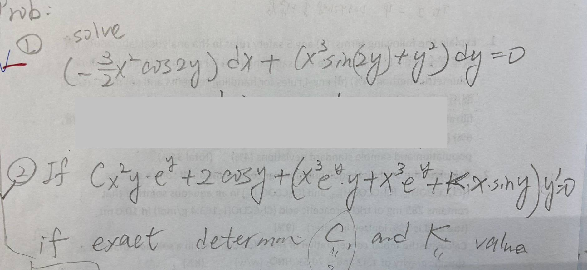

# Homework 1

## Question 1

$$
(\frac{3}{2}x^{2}\cos(2y))\,\mathrm{d}x + (x^{3}\sin(2y)+y^{2})\,\mathrm{d}y = 0
$$

## Question 2

$$
\begin{aligned}
&\text{If } \, Cx^{2}y\cdot e^{y}+2\cos y+(x^{3}e^{y}\cdot y+x^{3}e^{y}+K\cdot x \cdot \sin y)y' = 0 \\
&\text{If exact, determine } \, C \text{ and } K \text{ value?}
\end{aligned}
$$
