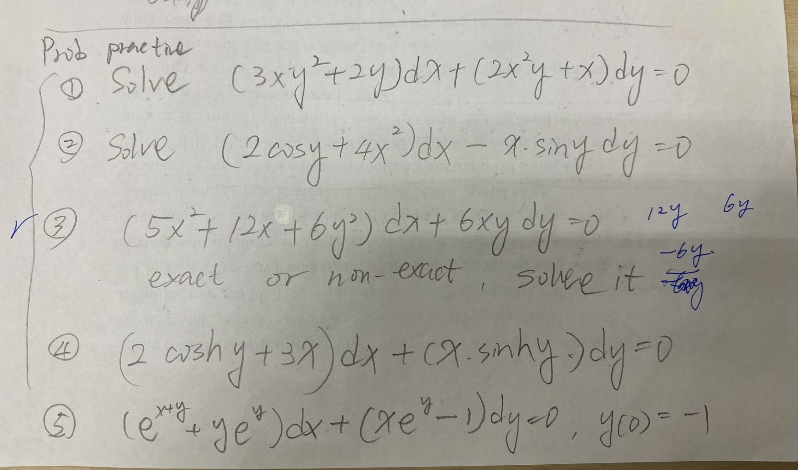
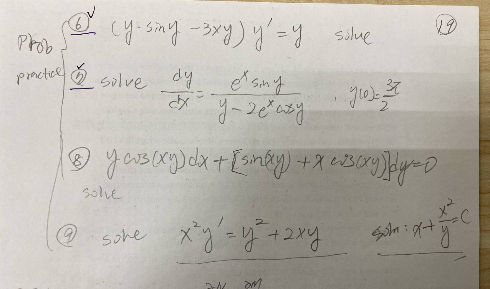

# Homework 2

## Quuestion 1

$$
(3xy^{2}+2y)\mathrm{d}x+(2x^{2}y+y)\mathrm{d}y = 0
$$

## Question 2

$$
(2\cos y+4x^{2})\mathrm{d}x-x\sin y\mathrm{d}x = 0
$$

## Question 3

$$
(5x^{2}+12x+6y^{2})\mathrm{d}x+6xy\mathrm{d}y=0
$$

## Question 4

$$
(2\cos h y +3x)\mathrm{d}x+(x\sin h y)\mathrm{d}y = 0
$$

## Quesetion 5

$$
(e^{x+y}+ye^{y})\mathrm{d}x+(xe^{y}-1)\mathrm{d}y = 0, \, y(0)=-1
$$

## Question 6

$$
(y\sin y - 3xy)y' = y
$$

## Question 7

$$
\frac{\mathrm{d}y}{\mathrm{d}x} = \frac{e^{x}\sin y}{y-2e^{x}\cos y}, \, y(0)=\frac{3\pi}{2}
$$

## Question 8

$$
y\cos(xy)\mathrm{d}x+[\sin(xy)+x\cos(xy)]\mathrm{d}y=0
$$

## Question 9

$$
x^{2}y'=y^{2}+2xy ,\, \text{solve}:x+\frac{x^{2}}{y}=C
$$
